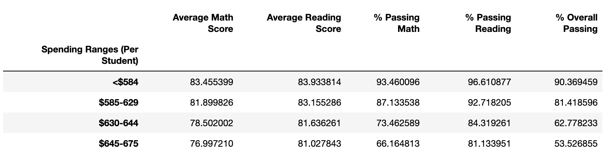

# school_district_analysis

# Project Overview:

* An analysis of school district data using Python (3.7.11), Anaconda, Jupyter notebooks, and Pandas to determine:

1. The district summary
2. The school summary
3. The top 5 and bottom 5 performing schools, based on the overall passing rate
4. The average math score for each grade level from each school
5. The average reading score for each grade level from each school
6. The scores by school spending per student, by school size, and by school type

## Resources:

* Data Sources: schools_complete.csv and students_complete.csv
* Software: Python 3.7.11, Anaconda, Jupyter Notebooks, Pandas

# School District Results:

* After removing the 9th grade scores from Thomas High School, it can be determined that final results were impacted from the original analysis as follows:

- The district summary (as shown below), shows "Average Math Score" changed from 79.0 to 78.9. However, the remaining data was unchanged. 

- The school summary (as shown below), shows "Overall % Passing" for Thomas High School changed from 90.9 to 65.1 resulting in a pronounced decrease in overall school standings from number 2 to number 8. In addition, homas High Schools % passing math and % passing reading both decreased from approximately 90% to 60%. However, remaining data was unchanged.

- Replacing the 9th grade scores had the following impacts (as shown below):

1. The math and reading scores had no significant changes (as noted below).

2.  The scores by school spending were minimally affected with slight changes to the $630-644 bin (as noted below). 

3. The scores by size were minimally affected (as shown below).

4. The scores by type were minimally affected (as shown below).

# Summary:

- Four changes that occurred in the updated school district analysis when 9th grade data was replaced with NaNs:

1. Thomas High Schools % passing math and % passing reading both decreased from approximately 90% to 60%. 
2. Thomas High Schools ranking based upon "% Overall Passing" decreased from 2 ranking to 8 ranking. 
3. District "Average Math Scores" decreased from 79.0 to 78.9.
4. Scores iini the $630-644 bin changed across all categories but only slightly. 

